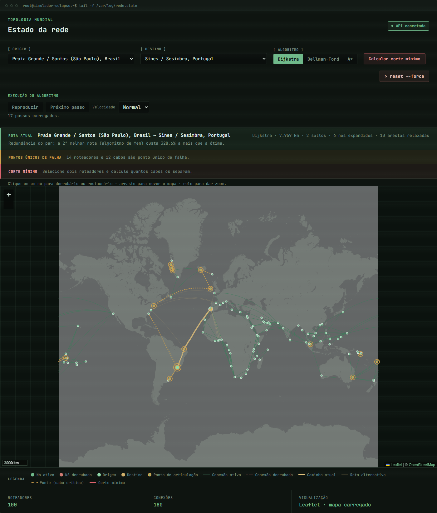

# Simulador de Colapso de Internet

Projeto da disciplina de Projeto de Algoritmos que representa uma malha mundial de
cabos como um grafo ponderado e recalcula a menor rota quando um nó ou uma conexão
fica indisponível. A aplicação permite comparar Dijkstra, Bellman-Ford e A* e
acompanhar o resultado em uma interface web interativa.



## Vídeo de apresentação

- [Assistir no YouTube](https://youtu.be/oVF8ElNQ7pA)
- [Assistir diretamente pelo repositório](PA-1-GRAFOS.mp4)
- [Baixar o vídeo em MP4](https://github.com/projeto-de-algoritmos-2026/G10_Grafos_PA-26.2/raw/refs/heads/main/PA-1-GRAFOS.mp4)

## Funcionalidades

- visualização de 100 pontos de conexão e 180 ligações associadas a sistemas reais de
  cabos submarinos;
- cálculo de menor caminho com Dijkstra, Bellman-Ford ou A* (heurística geodésica);
- queda e restauração de nós e cabos por clique;
- recálculo e destaque da rota sem recarregar a página;
- comparação simultânea de Dijkstra, Bellman-Ford e A* por custo, saltos, nós
  expandidos, arestas relaxadas e tempo de uma execução;
- indicação de rede particionada quando não existe caminho disponível;
- execução passo a passo dos algoritmos com reprodução, pausa, velocidade e respeito
  a `prefers-reduced-motion`;
- API HTTP documentada automaticamente pelo FastAPI.

## Pré-requisitos

- [Git](https://git-scm.com/);
- Python 3.12 ou superior;
- [uv](https://docs.astral.sh/uv/getting-started/installation/);
- acesso à internet no navegador é opcional: carrega o mapa-base do OpenStreetMap;
  sem ele, a topologia permanece interativa sobre um fundo neutro.

Não é necessário instalar Node.js nem executar um servidor separado para o
front-end.

## Instalação do zero

```sh
git clone https://github.com/projeto-de-algoritmos-2026/G10_Grafos_PA-26.2.git
cd G10_Grafos_PA-26.2
uv sync
```

O `uv sync` cria o ambiente virtual e instala as dependências da aplicação e de
desenvolvimento conforme o `uv.lock`.

As receitas canônicas do projeto ficam no `justfile`. Consulte todas com:

```sh
just --list
```

## Executando a demo

Na raiz do repositório, inicie o único processo necessário:

```sh
uv run uvicorn backend.main:app --reload
```

Abra <http://localhost:8000/> no navegador. Para testar o recálculo:

1. selecione uma origem e um destino;
2. escolha Dijkstra, Bellman-Ford ou A*;
3. opcionalmente, ative **Comparar algoritmos** para acompanhar as métricas lado a
   lado;
4. clique em um nó ou cabo do mapa para derrubá-lo;
5. observe a nova rota ou o aviso de particionamento;
6. clique novamente no elemento para restaurá-lo ou use **Resetar simulação**.

Verificações úteis:

- <http://localhost:8000/status> deve responder `{"status":"ok"}`;
- <http://localhost:8000/docs> abre o Swagger com o contrato da API.

Além da rota normal, `POST /rota/comparar` executa os três algoritmos sobre o mesmo
estado da rede sem alterar a rota destacada, e `POST /rota/passos` devolve o resultado
com um traço limitado de eventos. Para operações de cenário,
`POST /simulacao/falhas` aplica um lote validado atomicamente e
`POST /simulacao/resetar` restaura a sessão inteira e devolve o `GrafoState` atualizado
em uma única resposta.

Cada navegador recebe uma sessão HTTP isolada por cookie `HttpOnly`: quedas de nós,
quedas de cabos e a rota destacada não são compartilhadas com outros clientes. As
sessões expiram após 30 minutos sem atividade e há um limite de 100 sessões mantidas
em memória; uma sessão expirada recomeça com a malha íntegra. A topologia base é
carregada uma única vez e permanece imutável durante a execução. Reiniciar o processo
descarta todas as sessões e restaura a rede.

## Estrutura do repositório

```text
backend/
├── algorithms/       # Dijkstra, Bellman-Ford, A* e resultado compartilhado
├── data/rede.json    # topologia mundial usada pela aplicação
├── tests/            # testes unitários e de integração da API
├── graph.py          # grafo ponderado não dirigido
├── dataset.py        # esquema e validações do dataset
├── comparison.py     # execução instrumentada e comparação dos algoritmos
├── simulation.py     # falhas, restauração e seleção do algoritmo
├── state.py          # carga e estado em memória
└── main.py           # API FastAPI e entrega dos arquivos estáticos
frontend/             # interface em HTML, CSS e JavaScript
scripts/
├── validar_rede.py              # validação independente do dataset
├── benchmark.py                 # benchmark reproduzível dos algoritmos
├── comparar_dijkstra_a_star.py  # comparação sobre todos os pares da malha real
└── cascata.py                    # curvas de resiliência a falhas progressivas
docs/
├── benchmark/        # CSV, gráfico, metadados e análise da issue #7
├── images/           # capturas reais da interface
├── rede-mundial.md   # fontes e metodologia do dataset da issue #8
└── relatorio.md      # relatório final
```

## Testes e qualidade

Execute, a partir da raiz, o mesmo conjunto de verificações usado no CI:

```sh
just check
```

As receitas individuais são `just test`, `just lint` e `just fmt`. Os comandos crus
equivalentes continuam disponíveis abaixo para ambientes sem `just`. O `just test`
inclui testes baseados em propriedades com Hypothesis, que geram redes aleatórias e
verificam a equivalência de Dijkstra e Bellman-Ford, a validade dos caminhos e a
monotonicidade após falhas.

```sh
uv run pytest
uv run ruff check .
uv run ruff format --check .
```

Para conferir separadamente a integridade da topologia:

```sh
just validar
```

## Benchmark

O benchmark compara os algoritmos sobre grafos sintéticos aleatórios e em caminho,
usando os mesmos grafos em cada comparação, e inclui uma consulta na malha real:

```sh
just bench
```

O comando sobrescreve `docs/benchmark/benchmark.csv`,
`docs/benchmark/tempo_por_tamanho.png` e `docs/benchmark/metadata.json` com uma nova
execução. Os tempos variam conforme a máquina. A metodologia, os dados já medidos e a
interpretação estão em [docs/benchmark/analise.md](docs/benchmark/analise.md).

## Análise de resiliência

Para comparar falhas aleatórias com ataques dirigidos por grau e articulação:

```sh
uv run python scripts/cascata.py
```

O comando gera CSV, gráfico e metadados reproduzíveis em `docs/benchmark/cascata/`.
A análise da execução versionada está em
[docs/benchmark/cascata/analise.md](docs/benchmark/cascata/analise.md).

## Documentação

- [Relatório final](docs/relatorio.md)
- [Dataset da rede mundial](docs/rede-mundial.md)
- [Análise do benchmark](docs/benchmark/analise.md)
- [Análise de resiliência](docs/benchmark/cascata/analise.md)

O relatório foi mantido em Markdown porque não há, no repositório, enunciado ou
cronograma que determine outro padrão. Se a disciplina exigir PDF ou formatação ABNT,
a versão de entrega deve ser gerada a partir desse conteúdo conforme a orientação do
professor.

## Autoria

- Gustavo Xavier Evangelista
- Lucas A. Zanetti

## Licença

Distribuído sob a licença MIT. Consulte [LICENSE](LICENSE).
