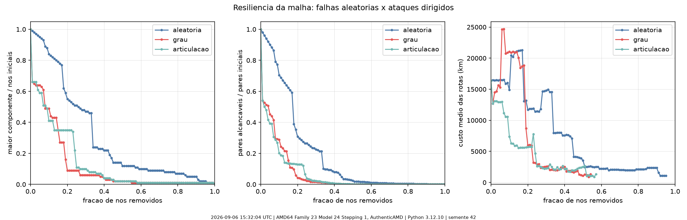

# Resiliência a falhas em cascata

Comparação empírica da conectividade da malha real sob falhas aleatórias e ataques
dirigidos. A execução é reproduzida com:

```sh
uv run python scripts/cascata.py
```

O comando gera neste diretório `cascata.csv` (pontos brutos),
`curva_resiliencia.png` (gráfico) e `metadata.json` (ambiente, parâmetros e hash do
dataset).

## Como foi medido

| | |
|---|---|
| Data | 2026-09-06 15:32:04 UTC |
| CPU | AMD64 Family 23 Model 24 Stepping 1, AuthenticAMD (8 núcleos) |
| SO / Python | Windows 11 / CPython 3.12.10 |
| Topologia | 100 nós e 180 arestas de `backend/data/rede.json` |
| Estratégias | aleatória, maior grau e ponto de articulação |
| Passos | 100 remoções por estratégia, além do ponto inicial |
| Semente | 42 |

Cada estratégia opera sobre uma cópia da mesma rede. A estratégia aleatória
embaralha os IDs ativos com uma instância local de `random.Random`; as estratégias
dirigidas recalculam a prioridade após cada remoção. `grau` escolhe o maior grau
ativo. `articulacao` escolhe primeiro entre os pontos de articulação atuais e usa
maior grau quando nenhum existe. Empates são resolvidos pelo ID.

As frações têm denominador fixo para não criarem uma recuperação artificial quando
restam poucos nós:

- maior componente: tamanho da maior componente / 100 nós iniciais;
- pares alcançáveis: pares conectados / 4.950 pares iniciais;
- custo médio: média dos menores custos somente entre pares que ainda possuem rota.

## Resultado medido

| Estratégia | 1ª remoção | Pares após 1 remoção | Passo abaixo de 50% dos pares | Fração removida no limiar |
|---|---|---:|---:|---:|
| aleatória | Kuakata | 98,0% | 18 | 18,0% |
| grau | Singapura | 54,0% | 5 | 5,0% |
| articulação | Singapura | 54,0% | 3 | 3,0% |

Depois de duas remoções, a sequência aleatória ainda conserva **96,0%** dos pares e
uma maior componente com **98,0%** dos nós iniciais. As estratégias de grau e
articulação ficam em **52,7% / 65,0%** e **50,1% / 66,0%**, respectivamente
(pares / maior componente).



As duas estratégias dirigidas começam por Singapura, o hub que liga vários sistemas
do Sudeste Asiático ao restante da malha. A curva aleatória perde nós periféricos nas
primeiras posições da sequência e só cruza o limiar de 50% dos pares após 18
remoções. O ataque por articulação cruza esse limiar após três remoções; o de grau,
após cinco.

O custo médio não é monotônico e não deve ser lido isoladamente como melhora. Quando
a rede se fragmenta, pares distantes deixam de ter rota e saem da média; por isso o
custo pode cair justamente quando a disponibilidade piora. As curvas de componente
e pares alcançáveis fornecem o contexto necessário.

## Interpretação e limitações

Nesta topologia, ataques dirigidos atravessam o limiar de 50% com 3%–5% dos nós
removidos, enquanto a sequência aleatória medida exige 18%. Isso evidencia o efeito
de hubs e articulações criados pelos gargalos geográficos da malha ampliada.

O experimento usa uma rede curada e apenas uma semente aleatória. Portanto, demonstra
o mecanismo com os dados do projeto, mas não constitui evidência estatística de que a
topologia seja uma rede livre de escala. Comparações probabilísticas exigiriam várias
sementes e intervalos de confiança.
