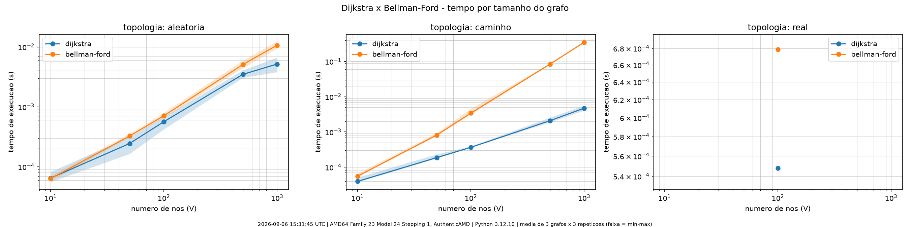
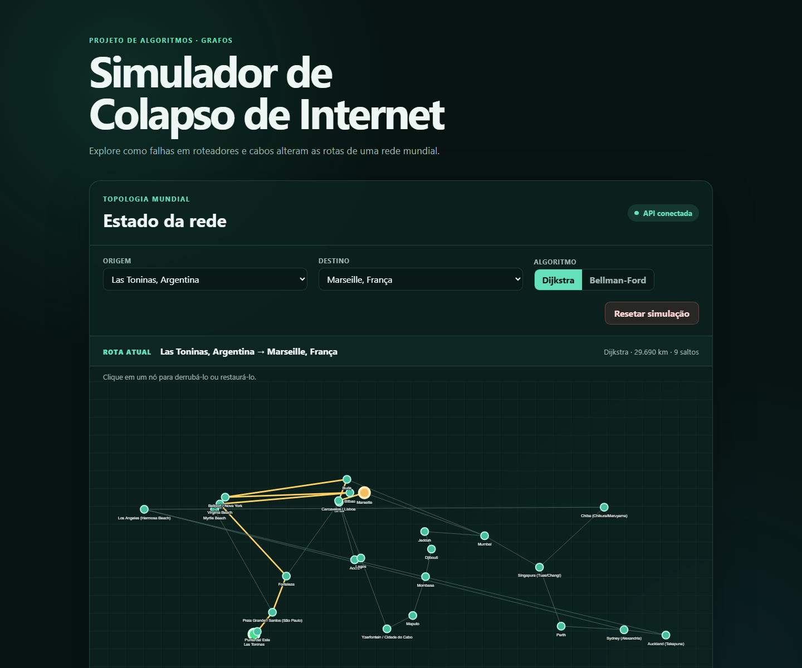
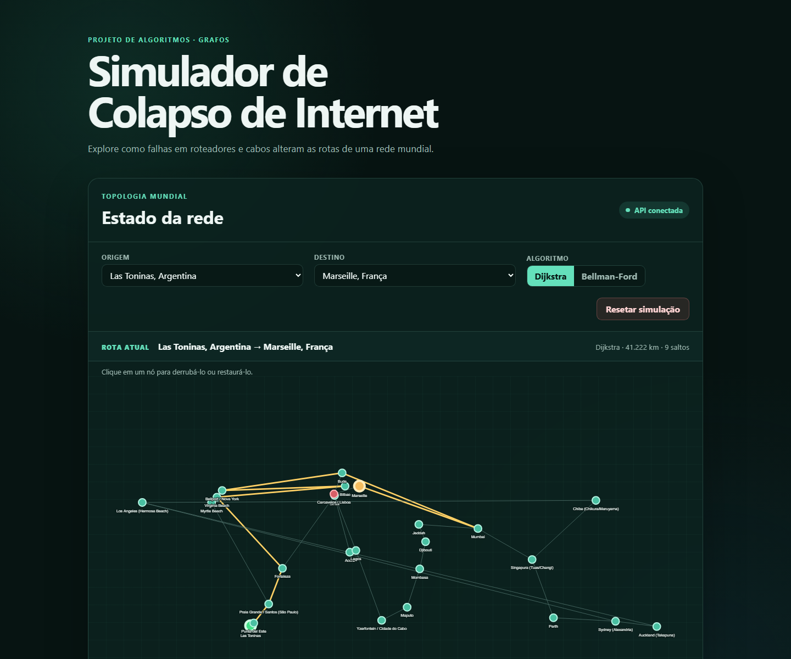

# Relatório final — Simulador de Colapso de Internet

**Disciplina:** Projeto de Algoritmos  
**Tema:** Grafos e caminhos mínimos  
**Autores:** Gustavo Xavier Evangelista e Lucas A. Zanetti  
**Repositório:** [G10_Grafos_PA-26.2](https://github.com/projeto-de-algoritmos-2026/G10_Grafos_PA-26.2)

> **Nota de formato:** não foi encontrado no repositório um enunciado ou cronograma
> que exija PDF ou normas ABNT. Por isso, este relatório foi produzido em Markdown.
> Caso exista uma orientação externa da disciplina, o conteúdo deve ser convertido e
> ajustado antes da entrega.

## Resumo

O projeto implementa um simulador visual de falhas em uma rede mundial. Pontos de
conexão são modelados como vértices, cabos como arestas e a distância geodésica entre
os pontos como peso. O usuário escolhe origem, destino e algoritmo de menor caminho;
quando um nó cai, a topologia disponível muda e a rota é calculada novamente. Foram
implementados Dijkstra e Bellman-Ford sem bibliotecas de algoritmos de grafos. Os
testes empíricos mostram o comportamento quase linear-logarítmico de Dijkstra nos
grafos esparsos avaliados e o pior caso quadrático de Bellman-Ford em uma topologia em
caminho.

## 1. Contexto e objetivo

A infraestrutura da Internet possui redundância: quando um equipamento ou enlace
fica indisponível, o tráfego pode usar outro caminho. O simulador apresenta essa ideia
em uma escala didática. Seu objetivo não é reproduzir protocolos como BGP ou medir a
Internet real, mas permitir a observação direta de três conceitos:

1. uma rede pode ser representada como grafo ponderado;
2. a melhor rota depende do estado atual de seus vértices e arestas;
3. algoritmos corretos para o mesmo problema podem ter custos computacionais
   diferentes.

A aplicação reúne uma API FastAPI, implementações próprias dos algoritmos e uma
interface web. O estado é mantido em memória durante a execução.

## 2. Modelagem como grafo

Seja o grafo `G = (V, E)`, em que `V` é o conjunto de pontos da rede e `E` é o
conjunto de conexões. Cada aresta possui peso numérico. Na topologia mundial do
projeto, esse peso é a distância Haversine arredondada, em quilômetros.

### 2.1 Grafo não dirigido

O domínio atual considera que cada cabo pode ser percorrido nos dois sentidos com o
mesmo custo. Por isso, o grafo é **não dirigido**. A estrutura usa lista de adjacência
e armazena cada cabo em duas entradas espelhadas: `u → v` e `v → u`. As operações de
queda e restauração atualizam as duas entradas juntas.

Essa decisão simplifica a demonstração, mas não representa assimetrias de capacidade,
latência ou política de roteamento. Um grafo dirigido é mantido como possível extensão.

### 2.2 Nó indisponível em vez de remoção física

Nós e arestas têm uma flag `is_up`. Derrubar um nó altera essa flag, mas preserva o
vértice e suas conexões na estrutura. Ao consultar os vizinhos, a implementação omite
arestas desligadas e destinos indisponíveis. Essa escolha tem duas consequências
importantes:

- restaurar um nó não exige reconstruir seus metadados e conexões;
- a interface consegue continuar desenhando a topologia completa e diferenciar os
  elementos ativos dos derrubados.

A remoção física tornaria a restauração mais complexa e perderia parte do histórico
visual da simulação. O mesmo princípio é aplicado aos cabos.

### 2.3 Estado e recálculo

Uma instância do grafo é carregada quando a API inicia. As operações de falha mudam
essa instância e invalidam a rota armazenada. Se origem e destino estiverem
selecionados, o front-end solicita imediatamente um novo cálculo. Não encontrar um
caminho é um resultado válido (`encontrada = false`), e não um erro HTTP.

## 3. Dataset

A malha contém **26 nós e 30 arestas**. Os nós representam landing points ou
agregações metropolitanas de pontos próximos. As arestas indicam conectividade lógica
associada a sistemas reais de cabos em serviço.

As coordenadas WGS84 foram obtidas no GeoNames. Os sistemas e seus landing points
foram consultados no mapa público da TeleGeography em 30 de agosto de 2026. Entre os
sistemas usados estão Firmina, Monet, EllaLink, MAREA, 2Africa, INDIGO e Southern
Cross NEXT. Cada aresta do arquivo `backend/data/rede.json` mantém a referência de sua
fonte.

O peso é calculado pela fórmula de Haversine entre as coordenadas exibidas. Portanto,
ele não deve ser interpretado como latência, capacidade ou comprimento físico exato
do cabo. A linha reta mostrada pela interface também não corresponde ao traçado no
fundo do mar. A metodologia completa e todas as fontes estão em
[rede-mundial.md](rede-mundial.md).

O carregamento rejeita IDs e arestas duplicadas, coordenadas inválidas, self-loops,
referências inexistentes, pesos não positivos ou incoerentes, fontes desconhecidas e
uma topologia desconexa. A validação pode ser repetida com:

```sh
uv run python scripts/validar_rede.py
```

## 4. Algoritmos de menor caminho

### 4.1 Dijkstra

Dijkstra mantém a menor distância conhecida da origem até cada vértice e uma fila de
prioridade. A cada passo, remove da fila o vértice de menor custo acumulado e relaxa
suas arestas: se passar pelo vértice atual melhora o custo de um vizinho, a distância
e o predecessor são atualizados. Quando o destino é removido da fila, a busca termina
e o caminho é reconstruído pelos predecessores.

A implementação usa `heapq` e lista de adjacência. Sua complexidade de tempo é
`O((V + E) log V)` e o espaço auxiliar é `O(V)`, além do armazenamento `O(V + E)` do
grafo. Dijkstra exige pesos não negativos; a implementação rejeita uma aresta negativa
ativa.

### 4.2 Bellman-Ford

Bellman-Ford relaxa todas as arestas repetidamente. Um caminho mínimo simples possui
no máximo `V - 1` arestas, portanto esse número de rodadas é suficiente. Uma rodada
adicional detecta ciclo negativo alcançável: se ainda for possível reduzir um custo,
não existe menor caminho bem definido.

Como o grafo é não dirigido, uma única aresta negativa utilizável já forma um ciclo
negativo de ida e volta. Essa capacidade do algoritmo permanece didática; o dataset
real usa somente pesos positivos.

O pior caso de tempo é `O(VE)` e o espaço auxiliar é `O(V + E)` na implementação,
que materializa os dois arcos de cada cabo antes do relaxamento. Há saída antecipada
quando uma rodada inteira não muda nenhum custo, o que melhora muitos casos práticos
sem alterar a cota de pior caso.

### 4.3 Comparação teórica

| Algoritmo | Tempo | Espaço auxiliar nesta implementação | Peso negativo |
|---|---:|---:|---|
| Dijkstra com heap | `O((V + E) log V)` | `O(V)` | não |
| Bellman-Ford | `O(VE)` no pior caso | `O(V + E)` | sim, com detecção de ciclo negativo |

Para uma malha esparsa, em que `E` cresce proporcionalmente a `V`, Dijkstra tende a
`O(V log V)`, enquanto o pior caso de Bellman-Ford tende a `O(V²)`.

## 5. Arquitetura da solução

O back-end separa a estrutura do grafo (`backend/graph.py`), os algoritmos
(`backend/algorithms/`), as operações de simulação (`backend/simulation.py`) e a API
(`backend/main.py`). A API expõe a topologia, o cálculo de rota e a queda/restauração
de nós e cabos. O FastAPI também serve o front-end estático, portanto a demonstração
precisa de um único processo.

O front-end usa HTML, CSS e JavaScript sem framework. O `vis-network` posiciona os
nós a partir de uma projeção equiretangular simples, destaca o caminho e trata cliques.
Toda alteração relevante busca novamente o estado do grafo e solicita o recálculo.

## 6. Avaliação empírica

### 6.1 Método

O benchmark da issue #7 foi executado em 30 de agosto de 2026, às 23:47 UTC, em um
Intel Core i7-1255U com 12 núcleos, Linux 7.1.9 e CPython 3.12.13. Foram avaliados
grafos com 10, 50, 100, 500 e 1.000 vértices, usando três grafos por tamanho e três
repetições por grafo. O relógio `time.perf_counter()` envolveu somente a chamada do
algoritmo.

Foram usadas duas topologias com pesos uniformes entre 1 e 100:

- **aleatória:** grafo esparso conexo, com `E ≈ 2V`;
- **caminho:** `E = V - 1`, com ordem de inserção adversa ao Bellman-Ford para expor
  seu pior caso.

Nas 30 combinações de topologia, tamanho e amostra, os dois algoritmos retornaram o
mesmo custo. Os dados brutos estão em [benchmark/benchmark.csv](benchmark/benchmark.csv),
e os metadados em [benchmark/metadata.json](benchmark/metadata.json).

### 6.2 Resultados medidos

Tempo médio por execução, em segundos:

| Topologia | V | E | Dijkstra | Bellman-Ford | Razão BF/Dijkstra |
|---|---:|---:|---:|---:|---:|
| aleatória | 10 | 20 | 0,000057 | 0,000051 | 0,9× |
| aleatória | 50 | 100 | 0,000215 | 0,000244 | 1,1× |
| aleatória | 100 | 200 | 0,000509 | 0,000489 | 1,0× |
| aleatória | 500 | 1.000 | 0,003062 | 0,003505 | 1,1× |
| aleatória | 1.000 | 2.000 | 0,006036 | 0,008176 | 1,4× |
| caminho | 10 | 9 | 0,000039 | 0,000045 | 1,1× |
| caminho | 50 | 49 | 0,000152 | 0,000503 | 3,3× |
| caminho | 100 | 99 | 0,000298 | 0,001834 | 6,1× |
| caminho | 500 | 499 | 0,001877 | 0,051190 | 27,3× |
| caminho | 1.000 | 999 | 0,003540 | 0,217266 | 61,4× |



No intervalo entre 100 e 1.000 vértices, a inclinação log-log medida foi 1,07 para
Dijkstra nas duas topologias. Para Bellman-Ford, foi 1,22 na topologia aleatória e
2,07 no caminho.

O resultado de Dijkstra é compatível com `V log V` nos grafos esparsos. Bellman-Ford
se aproxima de `V²` no caminho adverso, como prevê o pior caso. No grafo aleatório,
a saída antecipada encerra o algoritmo após a convergência, escondendo grande parte
do fator `V`; por isso o crescimento medido foi muito menor que o pior caso.

Os tempos absolutos pertencem à máquina registrada e não devem ser generalizados.
A conclusão relevante é a forma de crescimento. A análise detalhada está em
[benchmark/analise.md](benchmark/analise.md).

## 7. Resultados da interface

As capturas abaixo foram produzidas em 4 de setembro de 2026 com a aplicação local em
execução. O cenário selecionou Dijkstra, origem **Las Toninas** e destino
**Marseille**.

Antes da falha, a API retornou custo de **29.690 km** e o caminho:

```text
Las Toninas → Punta del Este → Praia Grande → Fortaleza → Virginia Beach →
Bilbao → Bellport → Bude → Carcavelos → Marseille
```



Depois de derrubar o nó **Carcavelos**, a interface recalculou a rota. A API retornou
custo de **41.222 km**, substituindo o trecho por um desvio via Mumbai:

```text
Las Toninas → Punta del Este → Praia Grande → Fortaleza → Virginia Beach →
Bilbao → Bellport → Bude → Mumbai → Marseille
```



O nó indisponível permanece desenhado em vermelho, coerente com a decisão de marcar
o estado em vez de removê-lo fisicamente. A rota nova aparece em amarelo.

## 8. Limitações e decisões em aberto

- **Grafo não dirigido:** não representa rotas assimétricas, políticas de trânsito ou
  custos diferentes conforme o sentido. Migrar para um grafo dirigido continua em
  aberto.
- **Peso aproximado:** distância Haversine não é latência nem comprimento real do
  cabo. Não há dados de capacidade, congestionamento ou disponibilidade histórica.
- **Topologia curada:** os 26 nós são uma amostra didática; pontos metropolitanos
  próximos foram agregados e as linhas não reproduzem a geometria submarina.
- **Simulação em memória:** não há persistência, usuários isolados nem controle de
  concorrência. Todos os clientes conectados ao mesmo processo compartilham o estado.
- **Escopo de falhas na interface:** nós podem ser alternados por clique; operações de
  cabo existem na API, mas não há um controle visual equivalente na versão atual.
- **Dependência de CDN:** a visualização requer acesso ao `vis-network` hospedado no
  unpkg. Não existe cópia local para uso totalmente offline.
- **Algoritmos didáticos:** a aplicação calcula menor caminho centralmente e não
  implementa protocolos distribuídos da Internet, como OSPF ou BGP.
- **Benchmark limitado:** houve uma única máquina, sem isolamento dedicado de CPU, e
  tamanhos até 1.000 vértices. As medições avaliam consultas origem–destino com saídas
  antecipadas, não árvores completas de caminhos mínimos.

## 9. Conclusão

O projeto demonstra que a separação entre topologia e disponibilidade torna simples
simular falhas reversíveis. Dijkstra é a escolha padrão adequada ao dataset, cujos
pesos são positivos, e apresenta melhor crescimento. Bellman-Ford oferece o contraste
didático: produz os mesmos custos na malha válida, aceita pesos negativos e evidencia
um pior caso muito mais caro quando a topologia força `V - 1` rodadas.

As capturas confirmam o fluxo principal da aplicação: uma falha preserva o nó para
visualização, altera o conjunto de caminhos utilizáveis e provoca um recálculo visível
da rota. O dataset, os testes e os artefatos do benchmark permitem reproduzir tanto a
demonstração quanto a análise apresentada.

## Referências do projeto

- [Documentação e fontes do dataset](rede-mundial.md)
- [Metodologia e análise completa do benchmark](benchmark/analise.md)
- [Dados brutos do benchmark](benchmark/benchmark.csv)
- [README com instalação e execução](../README.md)
